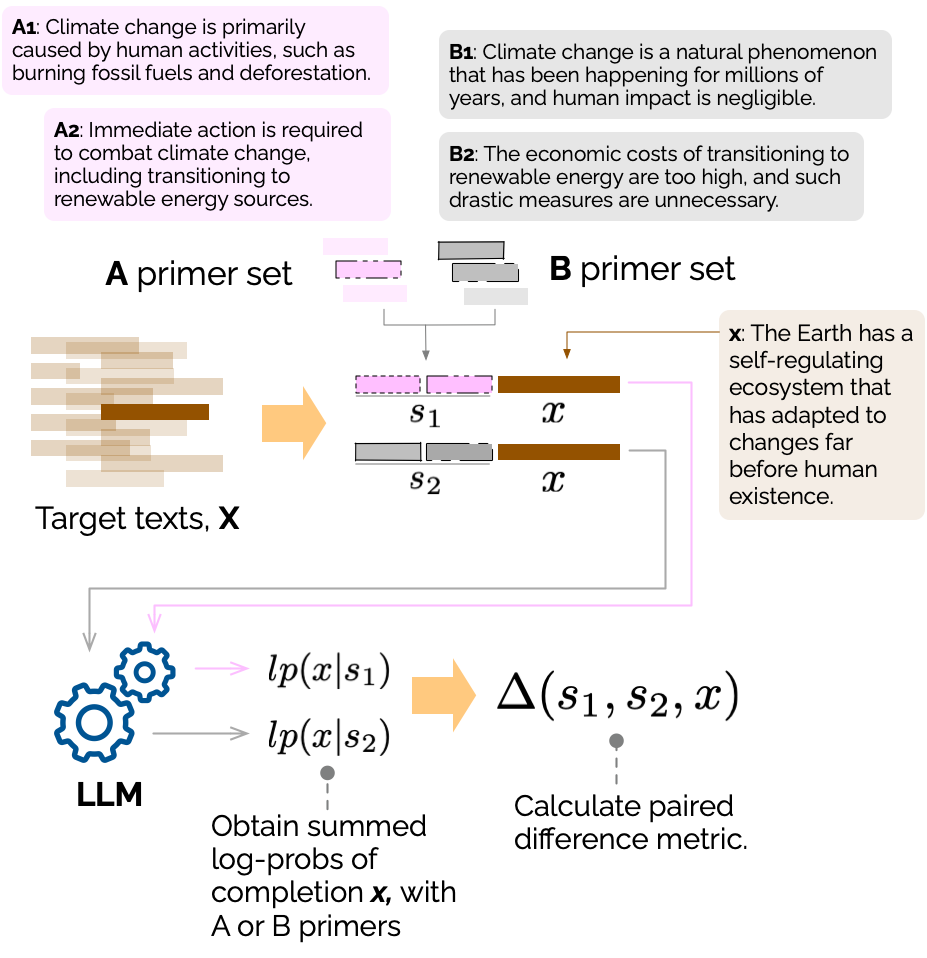

# Paired Completion: Generic Quantification of Issue-framing at Scale with LLMs
[Simon D. Angus](https://research.monash.edu/en/persons/simon-angus) & [Lachlan O'Neill](https://github.com/lachjames)

[SoDa Laboratories](sodalabs.io), Monash Business Schoool, Monash University

&#x1F4C4; Angus, S. D., & O'Neill, L. (2024). Paired completion: Flexible quantification of issue-framing at scale with LLMs. arXiv. https://arxiv.org/abs/2408.09742

## TL;DR
Paired completion provides a new way to analyse nuanced issue-framing (e.g. climate science advocacy vs. climate science denialism) without the need for large labelled datasets, leveraging log-probabilities of completions from large language models.



# Requirements
Depending on which experiment you are running, you will need access to valid API keys.
* For **paired completion**, you will need access to the OpenAI API, or DeepInfra API.
* For **baseline experiments** (tf-idf classifiers), no API keys are required.
* For **embedding experiments**, an OpenAI key is required for OpenAI embeddings.
* For **prompt-based experiments**, an OpenAI or DeepInfra API key is required.

To set `OPENAI_API_KEY` and/or `DEEPINFRA_API_KEY` to a valid OpenAI/DeepInfra API key, use, e.g.:
```bash
export OPEN_API_KEY="<your_key>"
```

# Installation/Setup

Install our Supercharged OpenAI Development API (soda) Python package

```bash
# Move into the soda directory
cd soda

# Install the requirements (e.g. openai)
pip install -r requirements.txt

# Install the soda package
pip install -e .

# Move back into the root directory
cd ..

# Move into the classifiers directory
cd classifiers

# Install requirements
pip install -r requirements.txt

# Run a paired completion experiment
python paired_completion.py
```

## Configuring Inference

We ran experiments on an NVIDIA H100 instance on Lambda Labs, using VLLM to create an inference server. We then edited `soda/soda/openai/text.py` to point to the VLLM server. We have configured `text.py` to instead point to DeepInfra, which supports the echo features required for our method. You will need to set an environment variable `DEEPINFRA_API_KEY` to a valid API key for DeepInfra, or alternatively you can edit `text.py` to point to another service (ChatGPT/Claude will be happy to help you with this if you're unfamiliar with the process).

# Running Experiments

Ensure you start these steps from the root directory (i.e. the directory containing this README file).

## Baseline Experiments (tf-idf; logistic regression)

```bash
# Move back to the root directory (if necessary)
# cd ../ # If necessary

# Move into the experiments directory
cd classifiers

# Run the baseline classification experiments
bash run_classifiers.sh
```

## Embedding Experiments

Note that you will need to install `fasttext` to use the fasttext embeddings (though we find the OpenAI embeddings are significantly better).

```bash
# Install fasttext if you want to use the fasttext embeddings
pip install fasttext

# Download cc.en.300.bin from (e.g.) https://www.kaggle.com/datasets/sanyatargrenkin/cc-en-300-bin
```

Embedding experiments can be run with `run_embeddings.sh`. This script uses papermill to run the experiments using the Jupyter notebook `embedding.ipynb`.

## Paired Completion Experiments

The code used for the paired completion experiments is split into three files in the `classifiers/` directory:

- `new_method_experiment.ipynb` contains the code for running individual experiments
- `import_data.py` contains the code for importing the data
- `analyze.py` contains the paired completion implementation

We use papermill for our experiments, which is a tool for running Jupyter notebooks from the command line. We have provided a script to run the paired completion experiments from the paper as `run_new_method_sentences_experiment.sh`.

We also prepared a script, `paired_completion.py`, which can be used to run individual experiments. You can modify the parameters at the top of the script, and/or create your own datasets, by following the data structure found in the JSON files in `gpt-4-only-corpora`. While the script seems to work, note that we used the Jupyter notebook/papermill approach for the experiments in our paper.

## Synthetic Datasets

The synthetic datasets used in the experiments are located in the `gpt-4-only-corpora` directory. As the name implies, these datasets were generated using GPT-4 (specifically `gpt-4-turbo-preview`).

# Citation
Please cite this work as:
```latex
@misc{angus_oneill2024paired_completion,
      title={Paired Completion: Flexible Quantification of Issue-framing at Scale with LLMs}, 
      author={Simon D Angus and Lachlan O'Neill},
      year={2024},
      eprint={2408.09742},
      archivePrefix={arXiv},
      primaryClass={cs.CL},
      url={https://arxiv.org/abs/2408.09742}, 
}
```
